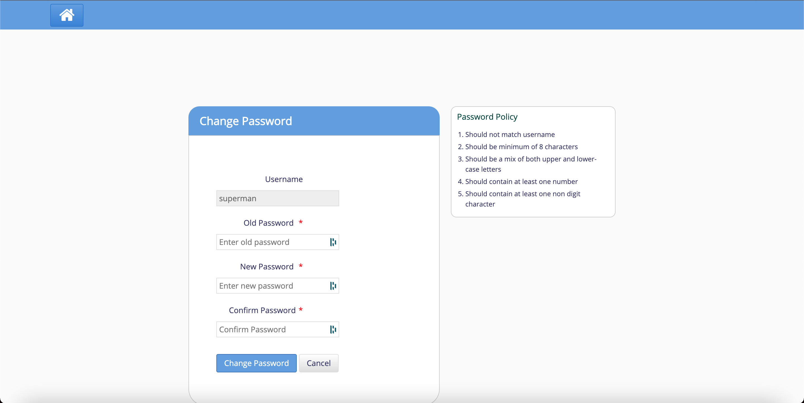

## Loggin into RAAD

### About the Feature
The providers will be created by hospital admin in OpenMRS admin module. The password will be set by the administrator. Using that password the user will login for the first time. Post that, the change password feature enables all the providers to change their password in RAAD.

### Used By
This feature can be used by any providers who can login to RAAD system

### How is it Used?

#### Login to RAAD
Enter your Username, Password provided by the admin (for initial login) or your changed password and select your Location.

#### Change Password
In RAAD, any logged in user can change the password. So the individual users do not need to depend on the admin to change the password. This option is available only on home dashboard.

Once the user selects Change Password, he/she will be automatically redirected to the change password page.

Once the password changed successfully user can go back to home dashboard by clicking on the home icon available in change password page.

## Registration

### About the Feature
Patient Registration provides the ability to start a patient file at a hospital. Most hospitals have a front desk where patients have to register before starting medical interactions such as consultation, lab tests, admission, procedures etc. The Registration Module in RAAD will be used at the front desk to capture patient information that can be collected by non-clinical staff. 

### Used By
The person at the Registration desk of the facility would predominantly use this module.

### How is it Used?
 The Registration Module allows for searching existing patients, adding new patients to the system, capturing name, photograph, address and specific attributes that the hospital may be interested in. It can also be configured to capture clinical information such as height, weight etc depending on a hospital workflow. 

#### Registration Page

#### Patient Search
The 'Search' tab has two fields that can be used for looking-up patients already registered on RAAD. One field is used for searching by patient identifier and the other for searching by a combination of name, address and other patient properties. If the patient identifier search uniquely finds the patient, the system automatically open the registration details page for the patient.

Alternatively, clicking on patient Id or name from the list of results will take the user to the registration details page for that patient.

#### Add Patient Relationships

The Patient Relationship section can be used to define relationships between Patients and Clinicians and Patients and other Patients.

If the relationship type selected is a clinician, such as a Doctor, then the drop down in the "Related To" column will display only a list of doctors that has been setup. If the relationship type selected is one such as a sibling or a parent, then the user can search for another registered patient using a patient identifier and create the relationship both the patient records.

Once this association has been setup, the implementer can then setup the Patient Information display control on Patient Dashboard which will display the Patient relationships.

#### Patient Relationship information on Patient Dashboard

### Print Patient ID
RAAD provides the ability to print Patient ID card after the patient is registered. This print can be accessed from the top right corner of the registration pages. This print can be configured to suit the needs of the hospital.

#### Visit Specific Details
Once a visit is started for a patient, RAAD allows for other information such as nutritional values to be computed. Users can be provided with the ability to capture the patient's height and weight. The system can then be configured to calculate BMI and other such clinical values automatically. RAAD also provides the ability to capture registration fee related information on this page. Along with this, administrators can configure to display a button which allows for the users to close a patient's active visit on this page.

## Clinical

### About the Feature
The Clinical Services feature is used to view the treatment history of existing patients, as well as to start a registered patient's treatment process in the medical facility.

### Used By
The physician / medical care provider of the facility would predominantly use this feature.

### How is it Used?
The Clinical Page allows for physicians to enter patient data, assign them to programs, capture consultation notes, prescribe medication, order tests, view patient graphs and trends, etc.

#### Search functionality
In the search fields of the queues we can search by either name or partial identifier of the patient. If the partial identifier can uniquely find the patient, it will automatically open the clinical dashboard of that patient.

### Capturing Consultation Data

#### Capturing Observations
The Observations tab in the clinical module in RAAD is a tab in the clinical consultation where clinicians can capture clinical observations for patients. The different forms used in different departments and sections by different providers in a hospital can be setup here as individual forms. Examples of such may be surgery, vitals, intake-output, delivery, gynecology, ANC, diabetes etc. RAAD provides the ability for the users to recall data previously filled in these forms, mark their favorite forms and compute drug orders automatically. Observations can be captured in various data formats including free text, numeric, boolean, drop-down with auto-complete ability, date, sigle select, multi select, grid etc. These forms can be created and edited by the implementer either manually using the OpenMRS administrator's interface or the custom CSV file import mechanism.

The Observations tab is mainly used by doctors and data entry personnel to record observations for a patient during a visit. These observations are captured across different forms that are configured for the hospital facility.

#### Recording Diagnosis and Conditions

Diagnosis is the most important clinical information of a patient. RAAD provides the ability to capture, edit and delete diagnoses for patients on a diagnosis tab inside clinical consultation. Clinicians can use this feature to capture diagnosis of patients and manage their old diagnoses. In the database these diagnoses can be mapped to ICD-10 codes for reporting purposes. RAAD allows users to configure your own attributes for each diagnosis, such as inactive, ruled out, etc.

#### Disposition

The Disposition tab is a place where doctors can provide instructions regarding the next steps for the patient. This is also an outcome indicator which relates to the continued care of a given patient after discharge.

It is used by the clinicians in the hospital to describe the further actions that need to be taken with regard to the patient. This could include instructions like "Admit to the hospital", "Discharge from the hospital", "Transfer to a different ward/bed", "Referred to a different doctor", "Referred for surgery", "Follow up required", "Consultation Complete", and so on.

#### Ordering Laboratory and Radiology Tests

Using this feature, a doctor can place place lab orders and procedure orders from clinical module. The procedure orders placed can then be viewed, relevant information can be added and it can be marked as completed. For lab orders, integration is built between the clinical (OpenMRS) and lab (OpenELIS/Odoo) systems to enable the lab dashboard to be auto-populated based on the order from the Clinical module. 

The need for an Order arises when the doctor or any other medical provider wants some action to be taken by some other medical provider in the Hospital for a particular patient.

#### Prescribing Medications

The Medications tab in the Clinical module in RAAD is a platform where clinicians can prescribe drug/medication orders to the patients. They can also manage old prescriptions for the patient here. A drug order can be added, edited, stopped or refilled on the Treatments tab. For each drug order, the system allows the clinicians to choose route, frequency, dosage and instructions. This feature has been designed to make the users highly time efficient, by providing them sensible defaults wherever possible.

The Medications tab is used by the clinicians to capture what medicines they have prescribed to the patient. In some cases, it is also used to indicate the medicines that the patient was on.

## Laboratory

### About the Feature
When a patient is registered in RAAD using the registration module, the patient name and demographic information is synced automatically to the lab system. When the patient goes to the lab, the lab technician collecting the sample can look up the patient and add tests for that patient. 

The lab module syncs back the tests added, along with the results and referral information back to the clinical module for the doctors and nurses to see this information. The key features of the laboratory management system are:

- Sample collection
- Recording tests and results.
- Referring tests.
- Printing out of results.
- Lab workload management.
- Generating Reports.

### Using Lab Dashboard

#### How is it Used?

1. Collect Samples

Clicking on Collect Sample takes the user to the "Add Sample" page. 

On the "Add Sample" page, the user can see the tests that are ordered by the doctor. The user can also see the corresponding samples that are to be collected. Click on "Generate" to generate an accession number for the sample. Then click on "Save"

2. Record Results

The user can also view the queue of patients to enter test results. On clicking "Result", the user can access the page where they can enter the test results against each test done for the patient. 

3. View Referred Out Test Counts
While recording the results user has an option to refer out the desired test(s) as explained here Referring out Laboratory Test(s) and Result Entry for the same. Once the test(s) are referred out, count of those tests can be seen in the Lab Dashboard under Samples Collected - Today / Backlog - Referred Out column. Total column in the dashboard includes the count of Referred Tests too.

4. Print Results
The user can validate the test results from the lab dashboard and also take a print out of the test result report for the patient. To do that click on the "Print" button in the "Action" column below

5. Print Sample Label 
        
        User can print the sample label (Accession Number) from the lab dashboard once the sample is collected for the test. Sample label will have following information:

        - Patient identifier
        - Patient name
        - Age
        - Gender
        - Accession number
        - Sample reception date and time
        - Accession barcode

        User can use a configuration to show or hide patient's personal details(age, gender, name) in the label. This is configured using the property “showPatientDetailsSampleLabel” in site_information table. By default it is set